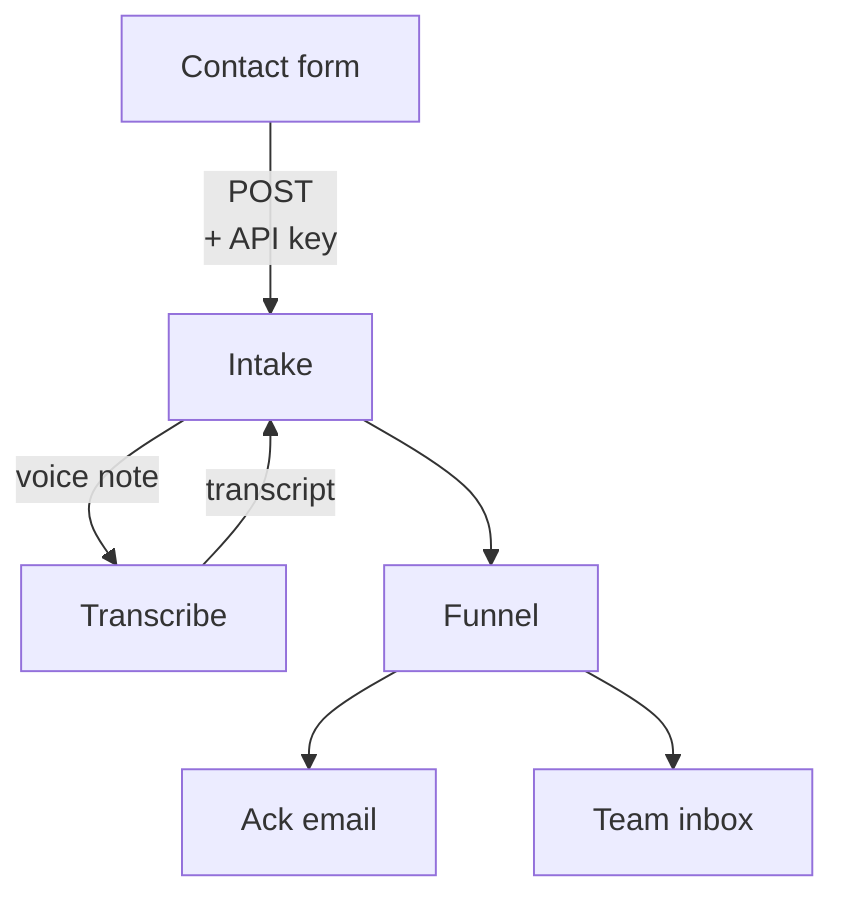
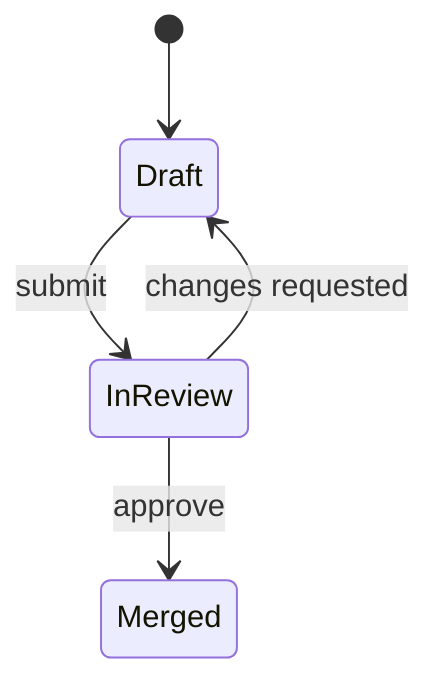
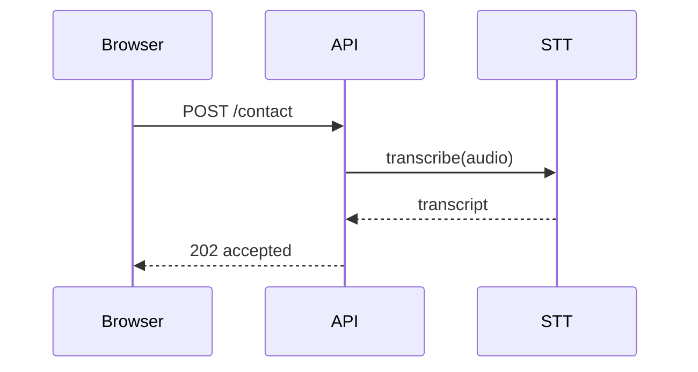

# Reference — ASCII patterns, mermaid recipes, publishing

## ASCII conventions

Keep the vocabulary small so diagrams read consistently:

- `│ ▼` vertical flow, `──►` horizontal flow
- `┌─┐ └─┘` boxes for things that act (services, stages, actors)
- Edge labels sit on the arrow, indented — that's where auth, protocol, and triggers go
- `*` for traps and caveats, listed *below* the diagram, never inside it
- ALL CAPS for section headers, since terminals have no heading styles

### Linear flow with an annotated edge

```
  ┌──────────────┐
  │ Contact form │  public — no database access
  └──────┬───────┘
         │  POST to the backend
         │  auth: API key
         ▼
  ┌──────────────┐
  │   Intake     │
  └──────────────┘
```

### Branch and rejoin

```
  ┌──────────────┐
  │   Intake     │ ── voice note? ──┐
  └──────┬───────┘                  ▼
         │                  ┌───────────────┐
         │                  │  Transcribe   │
         │◄──── transcript ─┴───────────────┘
         ▼
  ┌──────────────┐
  │    Funnel    │
  └──────────────┘
```

### Fan-out

```
  ┌──────────────┐
  │    Funnel    │
  └──────┬───────┘
         ├──────────────► ack email to sender
         └──────────────► thread into team inbox
```

### State machine

```
  [draft] ──submit──► [in review] ──approve──► [merged]
                            │
                         changes
                            ▼
                        [draft]
```

### Dependency tree

```
  app
  ├── @acme/ui ──── react-types
  ├── @acme/observability
  │   └── otel-sdk
  └── next
```

## Mermaid recipes

Open the code fence with the `mermaid` language tag. These render natively in
artifacts — no library needed.

**Flow** (the workhorse — use for pipelines, branches, fan-out):



**State machine:**



**Sequence** (best when *who calls whom, in what order* is the point):



Also available: `erDiagram` (schemas), `mindmap` (concept breakdown),
`gantt` (schedules), `timeline` (ordered events).

## Where mermaid falls down

Reach for hand-written HTML only for these — everything else, mermaid wins on cost:

- **Spatial/positional** layouts — UI annotation, floor plans, anything where *where a
  thing sits* carries meaning
- **Quantitative** charts — mermaid's chart support is weak; load the `dataviz` skill
- **Dense comparison** across many attributes — that's a styled table
- Precise control over sizing, overlap, or visual weight

## Publishing checklist

Publishing a deeper-dive artifact:

1. Write a **`.md` file** (not `.html`) — markdown pages keep their filename as identity,
   so name the file for the topic: `inbound-pipeline-deep-dive.md`
2. Content = mermaid fence + the detail the terminal answer compressed out
3. Call `Artifact` with `file_path`, a one-sentence `description`, and a `favicon` emoji
4. Keep the favicon **stable** across updates to the same artifact — the user finds the
   tab by its icon
5. To update later, edit the same file and re-publish with the same `file_path` — it
   redeploys to the same URL

Artifacts are default-private. There's no cap on how many you can create.
